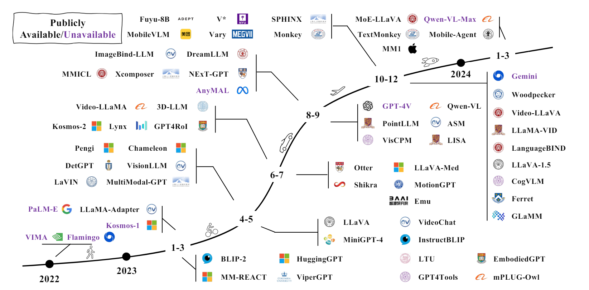
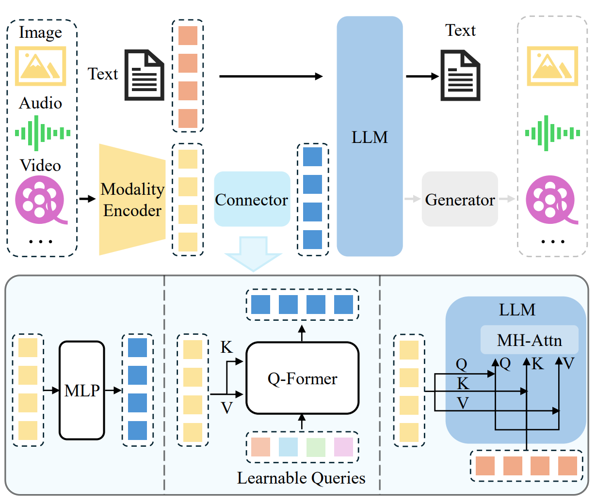
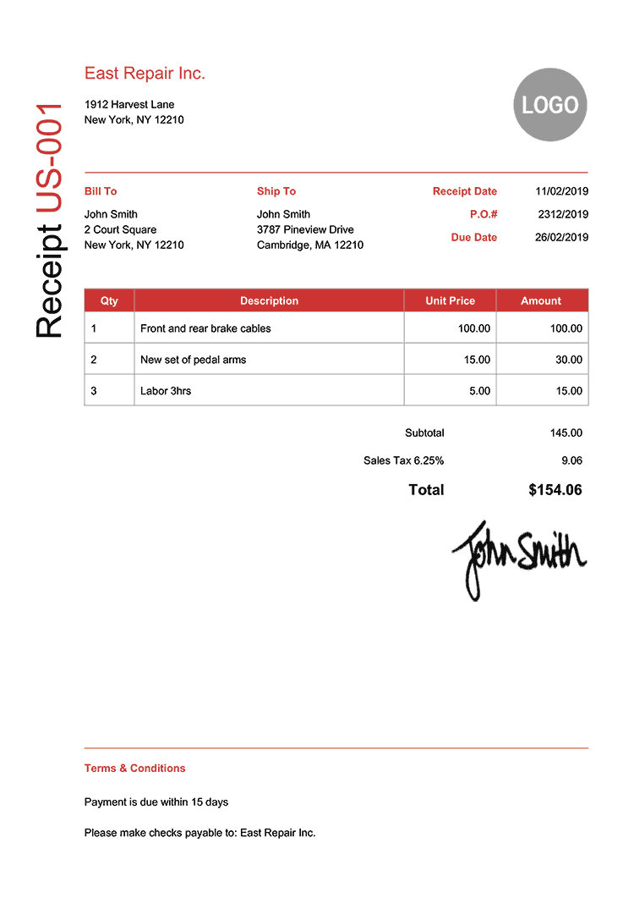
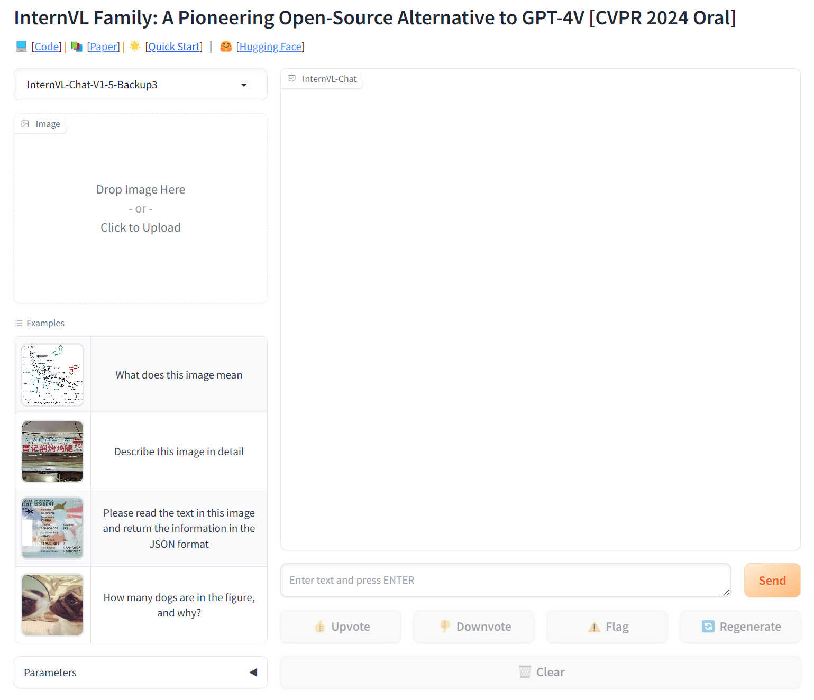
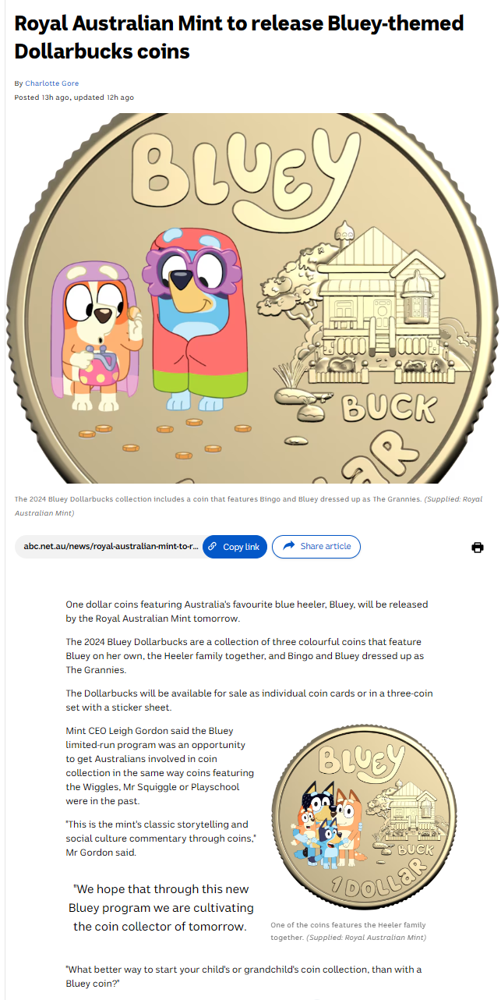

<!-- style: @import url('https://unpkg.com/tailwindcss@^2/dist/utilities.min.css'); -->

# Large Multimodal Model and Its Impact to Document Understanding

---
# **overview**

## 1. What is LMM?

## 2. Why LMM?

## 3. LMM Architeture and Training Strategy

## 4. A few LMM Examples

## 5. LMM Demo

## 6. Findings, Recommendations and Futher Resources
---

# What is LMM?

**Large Multimodal Model** 
<-> **Multimodal Large Language Model** 
<-> **Large Vision Language Models**

* LLM-based model with the ability to **receive**, **reason**, and **output** with multimodal information. 

* LMM manifests two representative traits: 
    - LMM is based on LLM with billion scale parameters, which is not available in previous multimodal models. 

    - LMM uses new training paradigms to unleash its full potential, such as multimodal instruction tuning to encourage the model to follow new instructions. 

---

# The motivation 

This research is to see if we can leverage the recent development of LMM to benefit the Document Understanding solution in ATO. 

1) improving the performance of models in the DU pipeline; 

2) improving the throughput of the DU pipeline; 

3) simplifying the DU pipeline by replacing multiple models with one or two models; 

4) simplifying the training or inference of the models in the DU pipeline. 

---

# Recent LMM Development

There has been a boom in research and development of LMM in recent years, particularly since last year.  

<!--  -->

---
# LMM Architecture (1)

A typical LMM can be abstracted into three modules, i.e., 
 1) a pre-trained modality encoder, 
 2) a pre-trained LLM, and 
 3) a modality interface to connect them. 

---
# LMM Architecture (2)

The typical LMM architechture is as follows

<!--  -->

  

---

# LMM Training Strategy and Data (1)

## Pre-training: entails large-scale text-paired data
 
 (1) aligning different modalities and   
 (2) providing world knowledge.

A common approach for pre-training is to keep pre-trained modules (e.g. visual encoders and LLMs) frozen and train a learnable interface.

---

# LMM Training Strategy and Data (2)
## Instruction-Tuning

Intuitively, instruction tuning aims to teach models to better understand the instructions from users and fulfill the demanded tasks. Instruction tuning learns how to generalize to unseen tasks rather than fitting specific tasks like the two counterparts. 

A multimodal instruction sample often includes an optional instruction and an input-output pair. The instruction is typically a natural language sentence describing the task, such as, “Describe the image in detail.” The input can be an image-text pair like the VQA task or only an image like the image caption task. The output is the answer to the instruction conditioned on the input.

---
# Some research in LMM 
1. MM1

2. LLaVA-1.5

3. InternVL
---
# MM1: 

## Key Contributions: studies of the importance of various architecture components and data choices
through ablations of the image encoder, the vision language connector, and various pre-training data choices.

## Findings:

1) large-scale multimodal pre-training using a careful mix of image-caption, interleaved image-text, and text-only data is crucial. 

2) the image encoder together with image resolution and the image token count has substantial impact, while the vision-language connector design is of comparatively negligible importance.

---
# LLaVA-1.5

## Key Improvements comparing to the base LLaVA:

(1) Scaling to high-resolution image inputs. 

(2) Compositional capabilities. 

(3) Data efficiency: randomly downsampling  

(4) Data scaling.

---

# InternVL

## Advantages:
(1) Strong Vision Encoder: large-scale vision foundation model—InternViT-6B, boosting its visual understanding capabilities. 

(2) Dynamic HighResolution: images being divided into tiles ranging from 1 to 40 of 448×448 pixels according to the aspect ratio and resolution of the input images, which supports up to 4K resolution input. 

(3) High-Quality Bilingual Dataset: dataset that covers common scenes and document images, which significantly enhancing performance in OCR- and Chinese-related tasks.

---

# Information Extraction Comparison

## Invoice

## Results

|        |InternVL	| LLaVA | EasyOCR + llama-3-70b-instruct |
|:---|:---|:---|:---|
|Company name|	East Repair Inc.	|East Repair Inc.| East Repair Inc_ |
|company address	|1912 Harvest Lane, New York, NY 12210.	| 1912 Harvest Lane, New York, NY 12210.| 1912 Harvest Lane, New York, NY 12210|
|Phone number	|not provided	|not visible|Not detected in the provided text|
|receipt number|	US-001	|US-001| Not detected in the provided text|
|rate and amount of tax|tax rate is 6.25%, the tax amount is $9.06	| The tax rate is 6.25%, and the amount of tax is $9.06.| Tax Rate: 6.25% Tax Amount: $9.06 |
|Due date	|26/02/2019	|26/02/2019| 26/02/2019 |
|receipt date	|11/02/2019|	11/02/2019| 11/02/2019 |
|Total amount	|$154.06	|$154.06| $154.06 |
|name of the first item in the table |	Front and rear brake cables.	| Front and rear brake cables.| East Repair Inc_ |
|nameof the last item in the table	| Labor 3hrs.	| Labor 3hrs.| Please make checks payable to: East Repair Inc|
|cost of the second item	|the cost of the second item, "New set of pedal arms", is $30	|The cost of the second item is $30.00.| Not detected in the provided text |

|        |InternVL	| LLaVA | EasyOCR + llama-3-70b-instruct |
|:---|:---|:---|:---|
|Company name|	East Repair Inc.	|East Repair Inc.| East Repair Inc_ |
|company address	|1912 Harvest Lane, New York, NY 12210.	| 1912 Harvest Lane, New York, NY 12210.| 1912 Harvest Lane, New York, NY 12210|
|Phone number	|not provided	|not visible|Not detected in the provided text|
|receipt number|	US-001	|US-001| Not detected in the provided text|
|rate and amount of tax|tax rate is 6.25%, the tax amount is $9.06	| The tax rate is 6.25%, and the amount of tax is $9.06.| Tax Rate: 6.25% Tax Amount: $9.06 |
|Due date	|26/02/2019	|26/02/2019| 26/02/2019 |
|receipt date	|11/02/2019|	11/02/2019| 11/02/2019 |
|Total amount	|$154.06	|$154.06| $154.06 |
|name of the first item in the table |	Front and rear brake cables.	| Front and rear brake cables.| East Repair Inc_ |
|nameof the last item in the table	| Labor 3hrs.	| Labor 3hrs.| Please make checks payable to: East Repair Inc|
|cost of the second item	|the cost of the second item, "New set of pedal arms", is $30	|The cost of the second item is $30.00.| Not detected in the provided text |

---

# Demo

<!-- [
 -->
  
<!-- 
] -->

---

# Findings

1. Signficant advancements in the field of LMM in the last two years, and still fast evolving.

2. Online tools demonstrates the capability of conducting many document understanding tasks including text extraction, informaiton extraction, document classification and some claim match tasks.

3. Space for improvement, particularly on information extraction from multiple documents per page, handling annotation, text grounding, and accurate claim match.
---
# Next steps:
1. Further research on model fine tuning including llm and vision models.

2. Start trying some of the advanced LMM such as InternVL, LLaVA-1.6, TextMonkey, LayoutLLM etc.

---
# Recommendations
1. Keep monitoring the development of LMM as it is still a very active research topic.

2. To conduct experiments to see if LMM is capable of doing specific document understanding tasks. This will involve more comprehensive evaluation on model performance, throughput, and resource required. 

3. To explore if we can create and utilise synthethic documents data for more targeted experiments.

4. Start planning on Vector Database for image/document data when building the ATO vector databases.

---

# Further resources

## Youtube Video:
* [Mastering Multimodal Models: Exploring Idefics2](https://www.youtube.com/watch?v=DrdlIxOC5ig)
* [Multimodal Generative AI Demystified](https://www.youtube.com/watch?v=8V2cUcuasYQ&t=8s)
## Website:
* [InternVL](https://github.com/OpenGVLab/InternVL)
* [LLaVA](https://github.com/haotian-liu/LLaVA)
* [TextMonkey](https://github.com/Yuliang-Liu/Monkey)
* [Awesome-Multimodal-Large-Language-Models](https://github.com/BradyFU/Awesome-Multimodal-Large-Language-Models)
* [Awesome-Document-Understanding](https://github.com/harrytea/Awesome-Document-Understanding)

---

## Further materiel for this presentation

You might have watched a nice video a few weeks ago called "Multimodal Generative AI Demystified". The Multimodal models mentioned in that video includes many types of input and many types of output. 

Note: With Document Understanding in consideration, this presentation will be focusing on multimodel on Image and Text. And it will also not involve any image generation.

---
# An example of interleaved image-text data:
<!--  -->

  

---
## Some of the challenges when I read the papers.
1. There is no consistent measure of the benchmark results.
