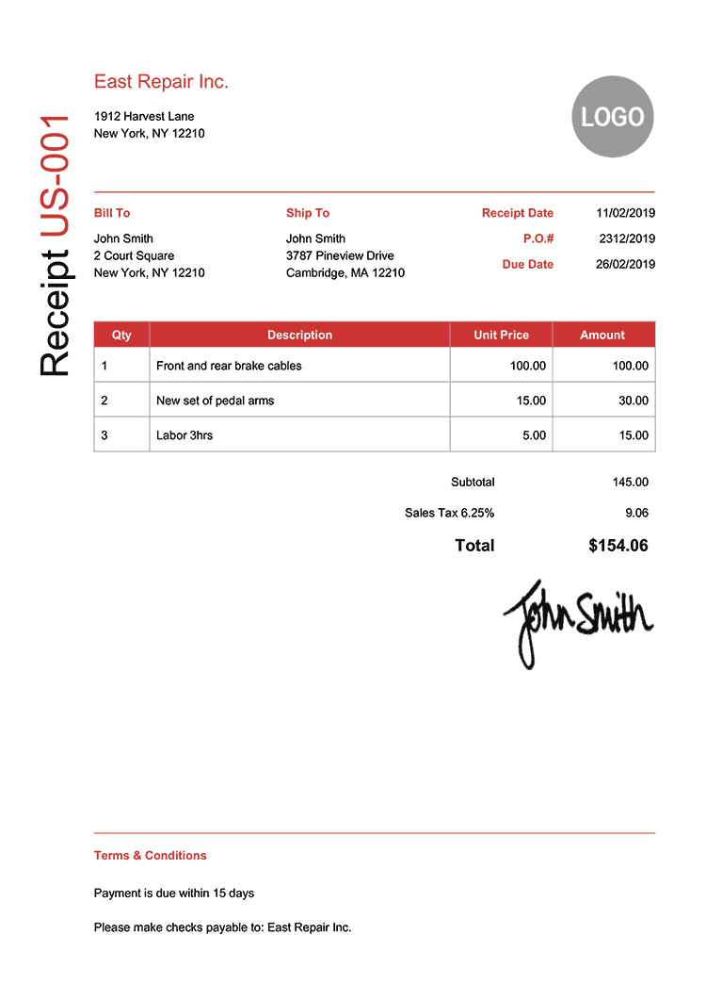

Large Multimodal Models and the Impact to Document Understanding
==============

# 1. Introduction

This technical report is to present an overview of the large multimodal models (LMM) and explore the impacts of LMM development to document understanding. The report includes the following sections. Section 2 introduces what is Large multimodel model and its manifests. Section 3 explains why we are interested in LMM, with the consideration of document understanding. Section 4 talks about LMM architeture, Training Strategy and Data. Section 5 discusses about LMM evaluation. Section 6 illustrates LMM hallucination and its mitigation. Section 7 discusses some findings, the limitations of this research, next steps and recommendations. This report also includes some highlights of the recent research paper, and results of document understanding using the online demos in the appendices. 

# 2. What is a Large Multimodal Model?

A large multimodal model refers to a large language model based model with the ability to receive, reason, and output with multimodal informaiton. In this definition, LMM always uses a large language model as the backbone, it was also referred as multimodal large language model (MLLM). In this report, we will focus on the multimodal models with input of both image and text. For the LMM with broader multimodalities, please refer to other general LMM discussions such as CVPR 2024 Tutorial on MLLM (https://mllm2024.github.io/CVPR2024/).

In addition to the terms of LMM and MLLM, many researchers use the term large vision language model (LVLM) to refer to the large multimodal models which can learn from images and text. In this paper, we will use these three terms exchangablly. 

According to [8], LMM manifests two representative traits compared with the traditional counterparts: (1) LMM is based on LLM with billion scale parameters, which is not available in previous models. (2)LMM uses new training paradigms to unleash its full potential, such as multimodal instruction tuning [3] to encourage the model to follow new instructions. 

---
# 2. Why we are interested in LMM?

It is to explore the art-of-possible, more specifically, to explore if and how LMM can make the document understanding solution more effective, more efficient and more scalable. 

## 2.1 Potential Improvements to the current DU pipeline 
We are looking at a few aspects of the DU pipeline for improvement. 1) The DU pipeline is very complex, consisting of 8 steps and more than 10 machine learning models. The complexity makes it very difficult to scale, not only scale up but also scale out. 2) The team has put a lot of effort to improve the efficiency of the DU pipeline in the last a few months, including trying faster models, parallel computing, revising post-processing of information extraction, in addition to the effort of having new hardware and platform. We would like to explore if LMMs can help increase the throughput of the DU pipline. 3) The performance of the models in the current DU pipeline is to be improved. It will require substantial amount of effort to get the training data, building and validating multiple models in the DU pipeline. 

## 2.2 Advance in LLM and LMM
LLM has revolutionised the field of artificial intelligence, enabling natural language processing teask that were previously through exclusive to humans. The emergence of GPT-3 brought a signficant leap in capabilities, particularly in few shot and zero-shot learning, highlighing the immence potential of LLMs. This promis was further realised with the advancements of ChatGPT and GPT-4. The progress in the field has been further accelerated by the emergence of open-source LLMs including the LLaMA series, Vicuna, Qwen etc.

## 2.2 Document understanding solution - Two Steps VS OCR Free
Extracting key information from a variety of sources, including documents like tables, forms, and invoices, as well as text in the wild is crucial for industries and acadmeic research, aiming to automate the refine document-based and scene-text workflows. This field requires text detection and recognition in both document images and real-world scenes, language comprehension, and the integration of vision and language.

Many early methods attempt to address the task using a two-stage approach: 1)Detect and recognise the text using external systems; 2)Document understanding based on the fusion of text results and images. However, the individual step of text reading in the processing pipeline may lead to the accumulation of errors. Moreover, relying on off-the-shelf OCR Models/APIs (OCR-Models) introduces additional engineering complexity, limits the connection between the text and its surrounding context, and can potentially increase computational costs. 

# 3. LMM Architeture
A typical LMM can be abstracted into three modules, i.e., a pre-trained modality encoder, a pre-trained LLM, and a modality interface to connect them. 

The typical LMM architechture is as follows (please refer to the repository wiki to know more about inserting images in github):

<!--  -->

  

## 3.1 Modality encoder
The encoders compress raw information, such as images or audio, into a more compact representation. Rather than training from scratch, a common approach is to use a pre-trained encoder that has been aligned to other modalities.

Rather than training from scratch, a common approach is to use a pretrained encoder that has been aligned to other modalities. 

For exaple, CLIP [[1]](#1) incorporates a visual encoder semantically aligned with the text through large-scale pre-training on image-text pairs. Therefore, it is easier to use such initially pre-aligned encoders to align with LLMs through alignment pre-training. Some commonly used image encoders are listed in Table 1:

Table 1: Commonly Used Image Encoders

|   Variants | pretaining corpus | Resolution | Samples(B) | Parameter Size (M)    |
| :--- | :--- | :---: | :---: | ---: |
|OpenCLIP-ConvNext-L|LAION-2B| 320 | 29 | 197.4|
|CLIP-ViT-L/14 | OpenAI's WIT| 224/336| 13 | 304.0|
|EVA-CLIP-ViT-G/14 |LAION-2B, COYO-700M | 224| 11 | 1000.0 |
|OpenCLIP-ViT-G/14 | LAION-2B | 224 | 34 | 1012.7 |
|OpenCLIP-ViT-bigG/14 | LAION-2B | 224 | 34 | 1844.9 |

Notably, many works have empirically verified that using higher resolution can achieve remarkable performance gains. In contrast, parameter size and training data compostion are of less importance compared with input resolution, found by empirical studies [[2]](#2). 

Please note: this is contradictory with the claim made by the InternV model in which the authors claims a large image encoder generates far more better results.

## 3.2 Pre-trained LLM

Instead of training an LLM from scratch, it is more efficient and practical to start with a pre-trained one. LLaMA series and Vicuna family are representative open-srouced LLMs that have attracted much attention. 

It should be noted that scaling up the parameter size of LLMs also brings additional gains, similar to the case of increasing input resolution. 

Recently, explorations of Mixture of Experts (MoE) architecture for LLMs have garnered rising attention. Compared with dense models, the sparse architecture enables scaling up total parameter size without increasing computational cost, by selective activation of parameters. Empirically, MM1 and MoE-LLaVA find that MoE implementation achieves better performance than the dense counterpart on almost all the benchmarks.

## 3.3 Modality Interface

Since LLMs can only perceive text, bridging the gap between natural language and other modalities is necessary. However, it would be costly to train a large multimodal model in an end-to-end manner. A More practical way is to introduce a learnable connector between the pre-trained visual encoder and LLM. The other approach is to translate images into languages with the help of expert models, and then send the language to LLM.

**Learnable Connector**. It is responsible for bridging the gap between different modalities. Specifically, the module projects information into the space that LLM can understand efficiently. Based on how multimodal information is fused, there are broadly two ways to implement such interfaces, *i.e.*, token-level and feature-level.

For token-level fusion, features output from encoder are transformed into tokens and concatenated with text tokens before being sent into LLMs. A common and feasible solution is to leverage a group of learnable query tokens to extract information in a query-based manner. Such Q-Former style approaches compress visual tokens into a smaller number of representation vectors. In contrast, some methods simply use a MLP-based interface to bridge the modality gap. For example, LLaVA [[3]](#3) adopts one/two linear MLP to project visual tokens and align the feature dimension with word embeddings.

On a related note, MM1 has ablated on design choices on the connector and found that for token-level fursion, the type of modality adapter is far less important than the number of visual tokens and input resolution.

As another line, feature-level fusion inserts extra modules that enable deep interaction and fusion between text features and visual features. 

Empirially reveal that the token-level fusion variant performs better in terms of VQA benchmarks. Rgarding the performance gap, the authors suggest that cross-attention models might require a more complicated hyper-parameter searching process to achieve comparable performance.

**Expert Model**. Apart from the learnable interface, using expert models, such as an image captioning model, is also a feaible way to bridge the modality gap. The basic idea is to convert multimodal inputs into languages without training. In this way, LLMs can understand multimodality by the converted languages. Though using expert models is straightforward, it may not be as flexible as adopting a learnable interface. The conversion of foreign modalities into text would cause information loss.

## 3.4 Some models using multiple resolution of images for pretraining
In these models, the visual encoder is no longer a CLIP as CLIP needs the image and text pair as training data. Instead these models using a pure visual encoder without text information. For example, InternVL[[5]](#5) used a a so-called dynamic high-resolution strategy to train a strong vision encoder named Intern ViT-6B-448px-V1.5. TextMonkey used a strategy including three steps: 1)shifted Window Attention; 2)Image Resampler; and 3)token resampler. In TextMonkey, the positional cues of the ansers were extracted and integrated into the answers themselves. Because of this strategy, it has a certain level of capacility of grounding, i.e., identifying the position of the information being extracted from the images. UReader also trained a visual encoder before passing the information to the LLM for instruction tuning. It also includes some grid information which makes it possible to present certain level of grounding capability.  

# 4. LMM Training Strategy and Data
A full-fledged LMM undergoes three stages of training, i.e. pre-training, instruction-tuning, and alignment tuning. Each phase of training requires different types of data and fulfills different objects.

## 4.1 Pre-training

### 4.1.1 Training Detail
As the first training stage, pre-training mainly aims to align different modalities and learn multimodal world knowledge. Pre-training stage generally entails large-scale text-paired data, e.g., caption data. Typically, the caption pairs describe images/audio/videos in natural language sentences. A common approach for pre-training is to keep pre-trained modules (e.g. visual encoders and LLMs) frozen and train a learnable interface. 

### 4.1.2 Data
Pretraining data mainly serve two purposes, i.e. (1) aligning different modalities and (2) providing world knowledge.

## 4.2 Instruction-Tuning
### 4.2.1 Introduction

Instruction refers to the description of tasks. Intuitively, instruction tuning aims to teach models to better understand the instructions from users and fulfill the demanded tasks. The comparisons between instruction tuning and related typical learning paradigms are illustrated in Fig. 3. The supervised fine-tuning approach usually requires a large amount of task-specific data to train a task-specific model. The prompting approach reduces the reliance on large-scale data and can fulfill a specialized task via prompt engineering. In such a case, though the few-shot performance has been improved, the zero-shot performance is still quite
average. Differently, instruction tuning learns how to generalize to unseen tasks rather than fitting specific tasks like the two counterparts. Moreover, instruction tuning is highly related to multi-task prompting.

### 4.2.2 Training Detail
A multimodal instruction sample often includes an optional instruction and an input-output pair. The instruction is typically a natural language sentence describing the task, such as, “Describe the image in detail.” The input can be an image-text pair like the VQA task or only an image like the image caption task. The output is the answer to the instruction conditioned on the input.

## 4.3 in context learning and few shot fine tuning
In-context Learning (ICL): ICL shines in its simplicity and flexibility. It allows for quick task adaptation through natural language prompts, making it ideal for situations where speed and ease of use are paramount.

Few-shot Fine-tuning (FT): FT provides more stable and consistent performance across various tasks and datasets. Though it requires more time and computational resources than ICL, the investment typically results in better performance, especially for complex or out-of-domain tasks.

# 5. LMM for Document Understanding

# 6. LMM Evaluation
Along with the booming of LMM, the evaulation of LMM has also made significant progress. Not only many benchmark datasets but also many Python packages were created to evaluate LMM.

One of the best GitHub repositories about LMM evaluation is 

[VLMEvalKit](https://github.com/open-compass/VLMEvalKit?tab=readme-ov-file#%EF%B8%8F-development-guide)

VLMEvalKit (the python package name is vlmeval) is an open-source evaluation toolkit of large vision-language models (LVLMs). It enables one-command evaluation of LVLMs on various benchmarks, without the heavy workload of data preparation under multiple repositories. It supports many popular LMMs such as GPT-4v, GPT-4o, Gemini, LLaVA, InternVL,Qwen-VL etc, and many benchmark datasets such as MME, OCRBench, DocVQA, TextVQA etc.

Another GitHub respository worth paying attention is   

[lmms-eval](https://github.com/EvolvingLMMs-Lab/lmms-eval)

---

---

# Appendix - LMM Demos

## Two available demos with advanced LMM models

* **[InternVL](https://internvl.opengvlab.com/)**

* **[LLaVA](https://llava.hliu.cc/)**

## information extraction examples

### **Receipt 1**

<!-- Table 2: Information extraction examples using two LMMs -->

|        |InternVL	| LLaVA | EasyOCR + llama-3-70b-instruct |
|:---|:---|:---|:---|
|Company name|	East Repair Inc.	|East Repair Inc.| East Repair Inc_ |
|company address	|1912 Harvest Lane, New York, NY 12210.	| 1912 Harvest Lane, New York, NY 12210.| 1912 Harvest Lane, New York, NY 12210|
|Phone number	|not provided	|not visible|Not detected in the provided text|
|receipt number|	US-001	|US-001| Not detected in the provided text|
|rate and amount of tax|tax rate is 6.25%, the tax amount is $9.06	| The tax rate is 6.25%, and the amount of tax is $9.06.| Tax Rate: 6.25% Tax Amount: $9.06 |
|Due date	|26/02/2019	|26/02/2019| 26/02/2019 |
|receipt date	|11/02/2019|	11/02/2019| 11/02/2019 |
|Total amount	|$154.06	|$154.06| $154.06 |
|name of the first item in the table |	Front and rear brake cables.	| Front and rear brake cables.| East Repair Inc_ |
|nameof the last item in the table	| Labor 3hrs.	| Labor 3hrs.| Please make checks payable to: East Repair Inc|
|cost of the second item	|the cost of the second item, "New set of pedal arms", is $30	|The cost of the second item is $30.00.| Not detected in the provided text |

**read the text and return information in JSON format. I need company name, address, phone number, date, and total amount**

**InternVL**  
{  
  "company_name": "East Repair Inc.",  
  "address": "1912 Harvest Lane, New York, NY 12210",  
  "phone_number": "N/A",  
  "date": {  
    "receipt_date": "11/02/2019",  
    "due_date": "26/02/2019"  
  },  
  "total_amount": "$154.06"  
}

**LLaVA**  
{  
  "company_name": "East Repair Inc.",  
  "address": "1912 Harvest Lane, New York, NY 12210",  
  "phone_number": "518-438-1000",  
  "date": "11/02/2019",  
  "total_amount": "$154.06"  
}

### **Receipt 2**

|        |InternVL	| LLaVA |
|:---|:---|:---|
|Company name	|BOOK TA_K (TAMAN DAYA) SDN BHD	|Tan Woon Yann.|
|Address of the company|	NO.5: 55,57 & 69, JALAN SAGU 18, TAMAN DAYA, 81100 JOHOR BAHRU, JOHOR.	|BOOK TA K (TAMAN DAYA) Sdn Bhd, No. 5, 55, 57 & 59, Jalan Sagu 18, Taman Daya, 81100 Johor Bahru, Johor.|
|Total amount	|9.00 RM	|9.00|
|Document number	|TD0117104	|TD016/1014|
|Phone number	|not provided|	955990416|
|what is the date |	25/12/2018 20:13 |	25/12/2018.|
|date	|The date on the receipt is 25/12/2018, which is 8:13:39 PM.	|25/12/2018.|
|item name	|KF MODELING CLAY KIDDY FISH	|RF MODELING CLAY KIDDY FISH.|

### **Receipt 3**

|        |InternVL	| LLaVA |
|:---|:---|:---|
|company name	|STOUT INDUSTRIES, INC.	|Stout Industries, Inc.|
|company address|	6425 W. FLORISSANT AVE., ST. LOUIS, MO 63136.	|6425 W. Florissant Ave., St. Louis, MO 63136.|
|Phone number |	(314) 385-2280.	|314-389-2800|
|addressee name	|Lorillard Corporation.|	Mr. A. D. Steinberg|
|addressee address	|666 Fifth Avenue, New York, NY 10103.	|666 Fifth Avenue, New York, 10019|
|date	|October 16, 1987.	|October 16, 1987.|
|item name	|Harley Davidson Metal Plaque.	|Harley Davidson Metal 'Pack' Plague|
|item number	|not provided in the visible portion of the document|	17k x 23"|
|number of the items	|500 Plaques.	|500 Plagues|
|item price	|$9.18 each.|	$9.18 each|
|total price	|$4,600.00	|$4,600.00|
|total payment	|$4,060.00	|$4,600.00|
|total billing	|$4,060.00	|$4,600.00|
|invoice number	| not visible in the provided image	|10675|

### **Bank Statement - InternVL **

* Describe the image in a short sentence

A statement from ANZ Home Loan showing transaction details.

* describe the image in less than 3 words

loan statement, 4 pages

* list all the interest items

The image lists several interest items in the "Transaction details" section. Here are the interest transactions listed:  
29 MAR INTEREST 2,374.71  
26 APR INTEREST 2,534.19  
26 MAY INTEREST 2,405.42  
15 JUN INTEREST 2,422.78  
26 JUL INTEREST 2,340.66  
26 AUG INTEREST 2,385.16  
26 SEP INTEREST 2,344.92  
These interest transactions are accompanied by corresponding credits and debits, and the balance after each transaction is also shown.

* list the items highlighted in yellow

The items highlighted in yellow in the image are:

The word "Interest" appears multiple times, indicating the interest charges for various dates.  
The total balance of "$634,828.60DR" at the end of the financial year is highlighted, indicating the final balance of the account.  

Please note that the highlighted items are inferred from the visual cues of the image, as the actual highlighting is not visible in the text provided.  

* what's the total balance

The total balance at the end of the period displayed on the statement is $634,828.60DR. This is shown in the "Totals at end of period" section at the bottom of the page.

* what's the total interest

The total interest paid over the financial year ending 30/06/2016 is $29,481.33. This amount is listed under the "Yearly summary" section at the bottom of the page.

* what is the earliest date of this statement

The earliest date of the transactions listed on this statement is 24 MAR, which is the date of the "BALANCE BROUGHT FORWARD" transaction.

* what is the last date of this statement

The last date of the transactions listed on this statement is 26 SEP, which is the date of the "INTEREST" transaction.

* what is the account number

The account number is 1010-10101, as indicated at the top of the statement.

* what is the phone number

There is no phone number visible on the statement provided in the image.

### Two invoices on one image

##### **LLaVA** 

* describe this image

The image you've provided appears to be a scanned copy of a retail store receipt. The receipt is from a store called "Target" and includes details of the items purchased, their prices, and the total amount paid. The items listed include various gift cards and possibly some other products, but the specific details are not entirely clear due to the resolution of the image.

The receipt also includes information about the payment method used, which seems to be a credit card, and the transaction date and time. There is a barcode at the bottom of the receipt, which is typically used for returns or exchanges. The receipt also contains a note about the store's return policy and a reminder to keep the receipt for future reference.

Please note that sharing personal information from receipts, such as credit card numbers or personal details, can be a security risk, so it's important to handle such information carefully.

* How many receipt does it have?

The image shows a single receipt from a retail store.

##### **InternVL**

* describe this image

The image is a photograph of a printed tax invoice from Target, a retail store, and a receipt from Bunnings Warehouse, a hardware store. The Target invoice is dated April 5, 2004, and lists various items purchased, including a 2-pack of impulse items, a Star gift bag, a Blue gift bag, and an exchange of a 60-day gift card. The total cost is $16.75, which includes GST (Goods and Services Tax) of $1.52. The Bunnings Warehouse receipt is dated February 19, 2004, and shows the purchase of a tap adapter and other items totaling $127.19. The receipt also includes a barcode for scanning and a note about OnePass, a membership program. The background of the image is white, and the text is printed in black, making it easily readable.

* how many receipts are included

There are two receipts included in the image. One is from Target, and the other is from Bunnings Warehouse.

* describe the image in less than 10 words

Target and Bunnings Warehouse tax invoices.

* total amount on the target receipt

The total amount on the Target receipt is $16.75, which includes GST (Goods and Services Tax) of $1.52.

* total amount of the second receipt

The total amount on the Bunnings Warehouse receipt is $127.19.

* date of the first receipt

The date of the first receipt from Target is April 5, 2004.

* date of the second receipt

The date of the second receipt from Bunnings Warehouse is February 19, 2004.

* check the date of the second receipt again

The date of the second receipt from Bunnings Warehouse is February 19, 2004.

* phone number of target

(02) 6256 4000

* phone number of bunnings

(02) 6234 9500

* ABN of Target

The ABN (Australian Business Number) of Target is not visible in the image provided.

* items of the first receipt

The items on the first receipt from Target include a 2-pack of impulse items, a Star gift bag, a Blue gift bag, and an exchange of a 60-day gift card.

* items of the second receipt

The items on the second receipt from Bunnings Warehouse include a tap adapter and other hardware items.

* list the items of the second receipt (the model has a bug here)

The items on the second receipt from Bunnings Warehouse include:

12 M 7/16" TAP ADAPTER BRASS HULMAN  
2 M BSP GRIP GRIP 05AH  
2 X 1.5 M BSP GRIP GRIP 05AH  
2 X 1.5 M PLANT-PLUMB PLANT-PLUMB NEW  
1 X 1.5 M PLANT-PLUMB PLANT-PLUMB NEW  
1 X 1.5 M PLANT-PLUMB PLANT-PLUMB NEW  
1 X 1.5 M PLANT-PLUMB PLANT-PLUMB NEW  
1 X 1.5 M PLANT-PLUMB PLANT-PLUMB NEW  
1 X 1.5 M PLANT-PLUMB 

## An Example for Document Categorisation and Claim Match

1. is this relevant to a claim about attending academic conference?

Yes, this document is relevant to a claim about attending an academic conference. It is a record of an accepted symposium at the Annual Meeting of the American Association for the Advancement of Science (AAAS) in Los Angeles, which is an academic conference. The form details the symposium's title, speakers, and their affiliations, which can be used to verify attendance or participation in the event.

2. describe this image in less than 5 words

Document for AAAS symposium, Los Angeles.

3. There are a number of categories of documents including phone, tools, working from home, conference, car, and gift. Which category this image should belong to?

This image should belong to the "conference" category, as it is a document related to an academic conference and symposium.

4. what are the names of the speakers?

The names of the speakers mentioned in the document are:

* Dr. William J. Schull
* Dr. Jorge J. Yunis
* Dr. Sheldon Wolff
* Dr. Patricia Jacobs
* Dr. Raymond White
* Dr. Michael A. Bender

These speakers are affiliated with various universities and institutions, and their topics cover a range of subjects related to the human chromosome and cytogenetics.

# Selected LMM Papers

## Paper: LayoutLLM: Layout Instruction Tuning with Large Language Models for Deocument Understanding [[4]](#4) 

The architechture and training paradigms are show in the figure below.

<!--  -->

  

The overall architecture is as follow:

<!--  -->

  

## Paper: Visual Instruction Tuning (LLaVA) [[3]](#3) & Improved Baselines with Visual Instruction Tuning [[6]](#6)
Some findings from the later paper include:

(1) Scaling to high-resolution image inputs. We show that LLaVA’s architecture is versatile in scaling to higher resolutions by simply dividing images into grids and maintains its data efficiency; with the increased resolution, it
improves the model’s detailed perception capabilities and reduces hallucination. 

(2) Compositional capabilities. We find that large multimodal models are capable of generalizing to compositional capabilities. For example, training on long-form language reasoning together with shorter visual reasoning can improve the model’s writing capability for multimodal questions. 

(3) Data efficiency. We show that randomly downsampling LLaVA’s training data mixture by up to 75% does not significantly decrease the model’s performance, suggesting that the possibility of a more sophisticated dataset compression strategy can further improve LLaVA’s already efficient training pipeline. 

(4) Data scaling. We provide empirical evidence for the scaling of data granularity in conjunction with the model’s capability is crucial for an improved capability without introducing artifacts like hallucination.

## Paper: InternVL: Scaling up Vision Foundation Modesl and Aligning for Generic Visual-Linguistic Tasks [[5]](#5) 

The training strategy of InternVL consists of three progressive stages, including vision-language
contrastive training, vision-language generative training, and supervised fine-tuning. These stages effectively leverage public data from diverse sources, ranging from noisy image-text pairs on the web to high-quality caption, VQA, and multi-modal dialogue datasets. The working flow is show in the following figure:

<!--  -->

  

## Paper: MM1: Methods, Analysis & Insights from Multimodal LLM Pre-training [[2]](#2) 

In particular, we study the importance of various architecture components and data choices. Through
careful and comprehensive ablations of the image encoder, the vision
language connector, and various pre-training data choices, we identified several crucial design lessons. For example, we demonstrate that for
large-scale multimodal pre-training using a careful mix of image-caption,
interleaved image-text, and text-only data is crucial for achieving stateof-the-art (SOTA) few-shot results across multiple benchmarks, compared to other published multimodal pre-training results. Further, we
show that the image encoder together with image resolution and the image token count has substantial impact, while the vision-language connector design is of comparatively negligible importance

## Paper: On the Hidden Mystery of OCR in Large Multimodal Models [[7]](#7)
This paper proposed OCRBench, a comprehensive evaluation benchmark for OCR. The findings are:

* **Semantic-Reliance**. LMMs primarily rely on semantic understanding to recognize words. In our experiments,
we observed that LMMs exhibit poor recognition performance when it comes to character combinations that
lack semantic meaning. Specifically, when we altered the order of letters in each word, the accuracy of LMMs
on the NST dataset decreased by an average of 57.0% compared to the ST dataset, while the SOTA method for
4 scene text recognition only drops by around 4.6%. We believe this is because the SOTA method for scene text
recognition directly recognizes each character, and semantic information is just used to assist the recognition
process, while LMMs primarily rely on semantic understanding to recognize words. This finding is further
supported by the low accuracy observed on the ORAND dataset. As shown in Fig. 1, LMM successfully
identified the word "Message," but incorrectly recognized "egaesMs," which is a rearranged version of the
word "Message."

* **Handwritten Text**. LMMs may encounter difficulties in accurately recognizing handwritten text due to various reasons, including the resemblances in shapes between handwritten letters and numbers. Handwritten text
often appears incomplete or blurry due to factors like fast writing speed, irregular handwriting, or low-quality paper. On average, LMMs perform 51.9% worse than supervised state-of-the-art model in this task.

* **Multilingual Text**. The notable performance gap observed in LMMs on ReCTS, ESTVQA(En), and ESTVQA(Ch) highlights their limited proficiency in the Chinese language, as indicated in Tab. 1 and Tab. 2.
Among the LMMs, accurately recognizing Chinese words or responding to Chinese questions proves to be a
challenge. Monkey outperforms other LMMs in Chinese scenarios due to its LLM and visual encoder being
trained on a substantial amount of Chinese data.

* **Fine-grain Perception**. Currently, most LMMs have their input images limited to a resolution of 224 x 224,
consistent with the input size of the visual encoder used in their architecture. However, high-resolution input
images can capture more details from the image. Due to the limited input resolution of LMMs such as BLIP2,
their capacity to extract fine-grained information in tasks like Scene Text-Centric VQA, Document-Oriented
VQA, and KIE is constrained. However, LMMs such as Monkey, which can support a resolution of 1344×896,
exhibit improved performance in these specific tasks.

* **HMER**. LMMs struggle to recognize handwritten mathematical expressions due to the presence of messy
handwritten characters, complex spatial structures, and the indirect LaTeX representation. The lack of training
data for the handwritten mathematical expression recognition task is also a crucial factor.

## References
<a id="1">[1]</a>
A.Radford, J.W.Kim, C.Hallacy, A.Ramesh, G.Goh, S.Agarwal, G.Sastry, A.Askell, P.Mishkin, J.Clark et al.,
Learning transferable visual models from natural language supervisions.
in ICML, 2021

<a id="2">[2]</a>
B. McKinzie, Z. Gan, J.-P Fauconnier, S. Dodge, B. Zhang, P. Dufter, D. Shah, X. Du, F. Peng, F. Weers et al.,
MM1: Methods, analysis & insights from Multimodal LLM pre-training,
arXiv:2403.09611v4

<a id="3">[3]</a>
H.Liu, C.Li, Q.Wu, and Y.J.Lee, 
Visual instruction tuning,
NeruIPS 2023

<a id="4">[4]</a>
Chuwei Luo and Yufan Shen and Zhaoqing Zhu and Qi Zheng and Zhi Yu and Cong Yao, 
LayoutLLM: Layout Instruction Tuning with Large Language Models for Document Understanding,
CVPR 2024

<a id="5">[5]</a>
Chen, Zhe and Wang, Weiyun and Tian, Hao and Ye, Shenglong and Gao, Zhangwei and Cui, Erfei and Tong, Wenwen and Hu, Kongzhi and Luo, Jiapeng and Ma, Zheng and others
How Far Are We to GPT-4V? Closing the Gap to Commercial Multimodal Models with Open-Source Suites
arXiv:2404.16821, 2024

<a id="6">[6]</a>
H.Liu, C.Li, Q.Wu, and Y.J.Lee, 
Improved Baselines with Visual instruction tuning,
arXiv:2310.03744, 2024

<a id="7">[7]</a>
Y.Liu, Z.Li, B.Yang, C.Liu et al.
On the Hidden Mystery of OCR in Large Multimodal Models,
arXiv:2305.07895v5, Jan. 2024

<a id="8">[8]</a>
S. Yin, C. Fu, S. Zhao et al. 
A Survey on Multimodal Large Language Models,
arXiv:2306.13549v2, Apr. 2024